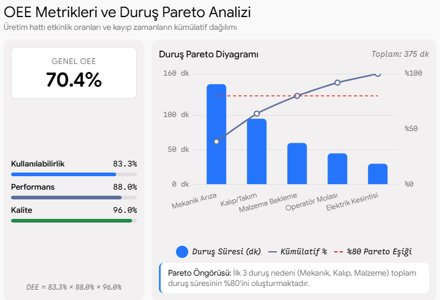

# ⚙️ Overall Equipment Effectiveness (OEE) & Downtime Pareto Analyzer

A lean manufacturing analytics tool that calculates the 3 pillars of **OEE (Availability, Performance, Quality)** and applies the **Pareto Principle (80/20 Rule)** to isolate root causes of line stoppages.

## 📊 Performance Scorecard & Pareto Output

## 📌 Theoretical Formulations
- **Availability ($A$):** $\frac{\text{Operating Time}}{\text{Planned Production Time}}$
- **Performance ($P$):** $\frac{\text{Ideal Cycle Time} \times \text{Total Count}}{\text{Operating Time}}$
- **Quality ($Q$):** $\frac{\text{Good Count}}{\text{Total Count}}$
- **OEE:** $A \times P \times Q$

## 🚀 Key Features
- **3-Pillar Operational Evaluation:** Direct calculation of real-world shift efficiency against World-Class OEE benchmarks.
- **Root-Cause Downtime Pareto Chart:** Dual-axis visualization with an automated 80% threshold line to guide Kaizen/SMED prioritization.
- **Production Loss Breakdown:** Quick identification of availability losses vs. speed/quality bottlenecks.

## 🛠️ Tech Stack
- Python 3.9+
- `pandas`, `matplotlib`
